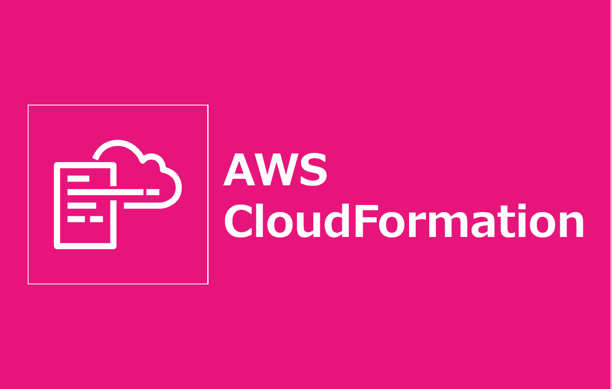

=====================================================================
デプロイ - CloudFormation -
=====================================================================

作業環境 - ローカル -
=====================================================================
* 64bit版 Windows 11 Pro
* Visual Studio Code 1.96.2 (Default Terminal: Git Bash)
* Git 2.47.1.windows.2
* AWS CLI 2.22.19.0 (profile登録&rainで利用する)
* Rain v1.20.2 windows/amd64

前提条件
=====================================================================
* *AdministratorAccess* がアタッチされているIAMユーザーのアクセスキーID/シークレットアクセスキーを作成していること
* 実作業は *cfn* フォルダ配下で実施すること
* 以下コマンドを実行し、*admin* プロファイルを作成していること (デフォルトリージョンは *ap-northeast-1* )

.. code-block:: bash

  aws configure --profile admin

事前作業(1)
=====================================================================
1. 各種モジュールインストール
---------------------------------------------------------------------
* `GitHub <https://github.com/tyskJ/common-environment-setup>`_ を参照

事前作業(2)
=====================================================================
1. デプロイ用S3バケット作成
---------------------------------------------------------------------
.. code-block:: bash

  DATE=$(date '+%Y%m%d')
  aws s3 mb s3://ep003-cfn-$DATE --profile admin

実作業 - ローカル -
=====================================================================
1. リダイレクトルールJSONファイル修正
---------------------------------------------------------------------
* *redirect-rule.json*ファイルの *HostName* をリダイレクト先FQDNに修正

.. code-block:: json

  {
    "RoutingRules": [
      {
        "RoutingRuleCondition": {
          "KeyPrefixEquals": "test1/"
        },
        "RedirectRule": {
          "HostName": "リダイレクト先FQDN",
          "ReplaceKeyPrefixWith": "test1/"
        }
      },
      {
        "RoutingRuleCondition": {
          "KeyPrefixEquals": "test2/"
        },
        "RedirectRule": {
          "HostName": "リダイレクト先FQDN",
          "ReplaceKeyPrefixWith": "test2/"
        }
      }
    ]
  }

2. リダイレクトルールJSONファイルアップロード
---------------------------------------------------------------------

3. *webstack* デプロイ
---------------------------------------------------------------------
.. code-block:: bash

  rain deploy webstack.yaml WEBSTACK \
  --s3-bucket ep003-cfn-$DATE \
  --config webstack-parameter.yaml --profile admin

* 以下プロンプトより入力

.. csv-table::

  "Parameter", "概要", "入力値"
  "LatestAmiId", "AmazonLinux2023最新AMIID", "何も入力せずEnter"
  "HostedZoneId", "Route 53 Public Hosted Zoneに登録しているドメインのHosted zone ID", "ご自身で登録したホストゾーンID"
  "Fqdn", "ALBのAliasレコードを登録するときのFQDN", "ご自身で登録したいFQDN"
  "S3RedirectBucketName": "Redirect用S3バケット名"
  "S3RedirectRuleFileS3Uri": "リダイレクトルールJSONファイルのS3URI"

.. note::

  * *RecordSet* 作成に *HostedZoneId* を指定している
  * *HostedZoneName* にしたい場合は、 *ルートドメイン(.)* が必要

後片付け - ローカル -
=====================================================================
1. *webstack* 削除
---------------------------------------------------------------------
.. code-block:: bash

  rain rm WEBSTACK --profile admin

.. note::

  * webstack削除後、 *DNS検証* で自動作成されたホストゾーンの *CNAMEレコード* は残る
  * そのため、不要なら手動で *CNAMEレコード* を削除すること

参考資料
=====================================================================
リファレンス
---------------------------------------------------------------------
* `AWS CLI Command Reference <https://awscli.amazonaws.com/v2/documentation/api/latest/reference/index.html>`_
* `AWS CloudFormation ユーザーガイド <https://docs.aws.amazon.com/ja_jp/AWSCloudFormation/latest/UserGuide/aws-template-resource-type-ref.html>`_
* `Launching AL2023 using the SSM parameter and AWS CLI <https://docs.aws.amazon.com/linux/al2023/ug/ec2.html#launch-via-aws-cli>`_
