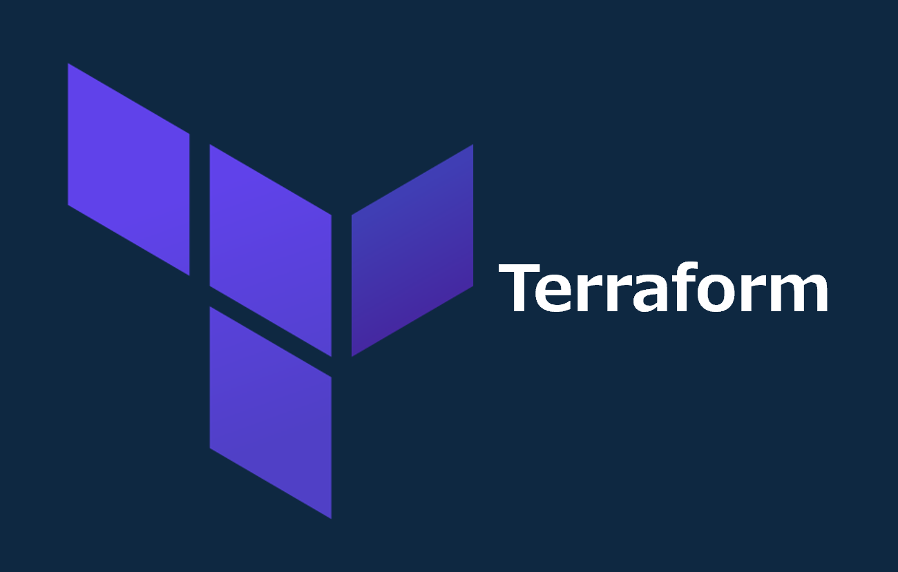

=====================================================================
デプロイ - Terraform -
=====================================================================

作業環境 - ローカル -
=====================================================================
* 64bit版 Windows 11 Pro
* Visual Studio Code 1.96.2 (Default Terminal: Git Bash)
* Git 2.47.1.windows.2
* tenv v4.1.0
* Terraform v1.10.3

フォルダ構成
=====================================================================
* `こちら <./folder.md>`_ を参照

前提条件
=====================================================================
* *AdministratorAccess* がアタッチされているIAMユーザーのアクセスキーID/シークレットアクセスキーを作成していること
* 実作業は *envs* フォルダ配下の各環境フォルダで実施すること
* 以下コマンドを実行し、*admin* プロファイルを作成していること (デフォルトリージョンは *ap-northeast-1* )

.. code-block:: bash

  aws configure --profile admin

事前作業(1)
=====================================================================
1. 各種モジュールインストール
---------------------------------------------------------------------
* `GitHub <https://github.com/tyskJ/common-environment-setup>`_ を参照

事前作業(2)
=====================================================================
1. *tfstate* 用S3バケット作成
---------------------------------------------------------------------
.. code-block:: bash

  aws s3 mb s3://tf-20250223 --profile admin

.. note::

  * バケット名は全世界で一意である必要があるため、作成に失敗した場合は任意の名前に変更
  * 変更した場合は、「 *envs/backend.tf* 」ファイル内のバケット名も修正

実作業 - ローカル -
=====================================================================
1. *Terraform* 初期化
---------------------------------------------------------------------
.. code-block:: bash

  terraform init

2. 事前確認
---------------------------------------------------------------------
* ご自身の環境に併せて変数の値を修正し実行

.. code-block:: bash

  terraform plan \
  -var "alb_cert_issue_domain_name=ALB用に発行する証明書のドメイン名" \
  -var "alb_hostzone_id=ALB用Aliasレコードを登録するパブリックホストゾーンのゾーンID" \
  -var "alb_fqdn=ALB用AliasレコードのFQDN" \
  -var "bucket_name=静的ウェブサイトホスティングを有効化するバケット名" \
  -var "cloudfront_cert_issue_domain_name=CloudFront用に発行する証明書のドメイン名" \
  -var "cloudfront_hostzone_id=CloudFront用Aliasレコードを登録するパブリックホストゾーンのゾーンID" \
  -var "cloudfront_fqdn=CloudFront用AliasレコードのFQDN"

3. デプロイ
---------------------------------------------------------------------
* ご自身の環境に併せて変数の値を修正し実行

.. code-block:: bash

  terraform apply --auto-approve \
  -var "alb_cert_issue_domain_name=ALB用に発行する証明書のドメイン名" \
  -var "alb_hostzone_id=ALB用Aliasレコードを登録するパブリックホストゾーンのゾーンID" \
  -var "alb_fqdn=ALB用AliasレコードのFQDN" \
  -var "bucket_name=静的ウェブサイトホスティングを有効化するバケット名" \
  -var "cloudfront_cert_issue_domain_name=CloudFront用に発行する証明書のドメイン名" \
  -var "cloudfront_hostzone_id=CloudFront用Aliasレコードを登録するパブリックホストゾーンのゾーンID" \
  -var "cloudfront_fqdn=CloudFront用AliasレコードのFQDN"

後片付け - ローカル -
=====================================================================
1. 環境削除
---------------------------------------------------------------------
* ご自身の環境に併せて変数の値を修正し実行

.. code-block:: bash

  terraform destroy --auto-approve \
  -var "alb_cert_issue_domain_name=ALB用に発行する証明書のドメイン名" \
  -var "alb_hostzone_id=ALB用Aliasレコードを登録するパブリックホストゾーンのゾーンID" \
  -var "alb_fqdn=ALB用AliasレコードのFQDN" \
  -var "bucket_name=静的ウェブサイトホスティングを有効化するバケット名" \
  -var "cloudfront_cert_issue_domain_name=CloudFront用に発行する証明書のドメイン名" \
  -var "cloudfront_hostzone_id=CloudFront用Aliasレコードを登録するパブリックホストゾーンのゾーンID" \
  -var "cloudfront_fqdn=CloudFront用AliasレコードのFQDN"

2. *tfstate* 用S3バケット削除
---------------------------------------------------------------------
.. code-block:: bash

  aws s3 rm s3://tf-20250223/ --recursive --profile admin
  aws s3 rb s3://tf-20250223 --profile admin

.. note::

  * *事前作業(2)* で作成したバケット名に合わせること

参考資料
=====================================================================
ブログ
---------------------------------------------------------------------
* `Terraform 0.15の変更点を調べた <https://dev.classmethod.jp/articles/terraform-015/#toc-providerconfiguration_aliases>`_
* `Terraformのmap型を駆使して、生成されるまで分からないリソースIDを取得する <https://tech.nri-net.com/entry/terraform_map_get_resource_id>`_
* `TerraformでDNSレコード,ACM証明書,ALBをプロビジョニングする際に入れておいたほうが良いコード <https://dev.classmethod.jp/articles/dnsrecord-acm-alb-with-terraform/>`_
* `【Terraform】ACMでSSL証明書を作成しDNS認証するときに遭遇したエラーたち <https://zenn.dev/kuuki/articles/error-aws-terraform-acm-dns-auth>`_
